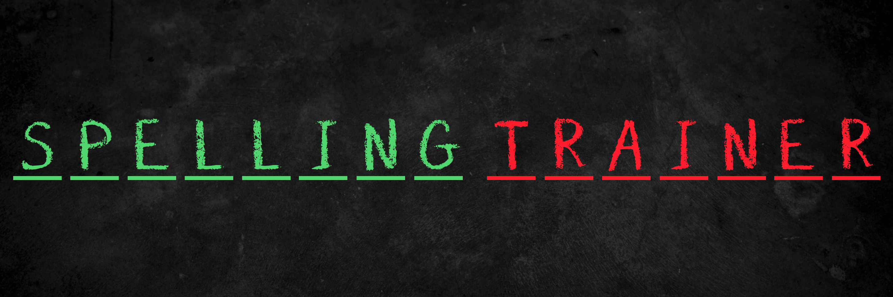
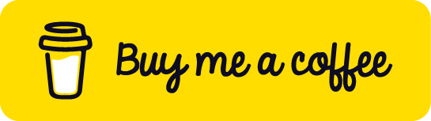

Spelling Trainer is an app designed to help you improve your English spelling skills through consistent practice and smart repetition.

Here’s how it works:

## 🎧 Hear it. 📝 Spell it.

You’ll be presented with a word and hear its pronunciation. Your task is to type the correct spelling of the word.

## ❌ Misspelled Words

If you misspell a word, it is added to the <b style="color: #C5000F">Misspelled Words</b> deck. You’ll need to spell it correctly to move it out of this deck, but not so fast! There’s a counter tracking your progress.

- Every correct spelling increases the counter by 1.

- A misspelling resets the counter to -1 or subtracts 1 if it’s already negative.

- Only when the counter becomes positive can the word move to the next stage.

## 🔁 Review Process

Once a word has been spelled correctly enough times to leave the Misspelled deck, it enters the <b style="color: #FFC409">Review</b> deck. To fully learn a word, you need to pass <b style="color: #FFC409">three spaced reviews</b>:

1. <b>First review:</b> 2 days after the last correct spelling.

2. <b>Second review:</b> 3 days after the first review.

3. <b>Final review:</b> 5 days after the second review.

If you misspell the word during any of these reviews, it goes back to the Misspelled Words deck and the process starts again.

## ✅ Known Words

After passing all three review stages, the word becomes a <b style="color: #28A745">Known Word</b>. You can continue practicing these words, but if you misspell one, it’ll go back to the Misspelled Words deck and need to be relearned.

## 🙈 Ignored Words

Not every word is worth your time. If you don’t want to study a particular word, you can move it to the Ignored Words deck. You can always restore it later if you change your mind.

Spelling Trainer turns spelling practice into a smart, structured, and repeatable process, helping you move words from <b style="color: #C5000F">“misspelled”</b> to <b style="color: #28A745">“mastered”</b>.

Ready to train your spelling?

## 💸 Don't Forget to Donate!

If you enjoy Spelling Trainer, please consider making a donation to support the project and help keep it free for everyone!

	

